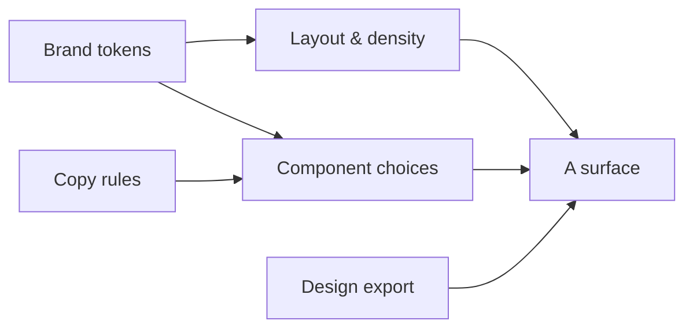

<!-- turystack:howto
     ─────────────────────────────────────────────────────────────────────
     HOW TO START {{PROJECT}}-uiux
     ·
     This skill arrives empty on purpose: every section carries
     a `turystack:unfilled` marker, and a surface whose design or tokens are
     unfilled stops and asks instead of guessing (UIX-3).
     ·
     It is filled from the design, not from taste. The sweep — tokens, layout,
     copy, component mapping, surfaces, and one theme per design system — is
     `turystack-harness` › `03-uiux-bootstrap.md`, and it starts by resolving
     where the design is. Ask for it:
     ·
         "bootstrap do uiux do {{PROJECT}} — o Figma é <link>"
     ·
     Day one is two sections, in this order:
     ·
         01-brand.md         tokens, both schemes
         03-copy.md          tone, casing, the state patterns
     ·
     What the design only implies arrives as a checklist to accept or reject
     (UIX-14 applies to what you accept: it becomes law here). What the design
     never said keeps its marker.
     ·
     When you have started — the tokens and the copy rules are written —
     remove these instructions; they describe an empty skill:
     ·
         npx @turystack/proof-mode-gates howto --strip .claude/skills/{{PROJECT}}-uiux
     ·
     That strips every `turystack:howto` block from this skill. The
     `turystack:unfilled` markers are not touched: those are decisions, and
     they go when someone makes them.
     ───────────────────────────────────────────────────────────────────── -->

# {{PROJECT}}-uiux — overview

> **Purpose.** This is {{PROJECT}}'s own UI/UX skill, materialized from
> `@turystack/uiux-template`. It holds the project's visual and verbal
> decisions, and the design exports its screens must match.

## Mental model

- **Brand** is the vocabulary: what the tokens are worth here.
- **Layout** is the rhythm: spacing scale, density, breakpoints.
- **Copy** is the voice: casing, tone, and the words for things.
- **Components** maps a product concept to the primitive that expresses it.
- **Assets** is the picture a surface has to match, with a version.

## Invariants

| ID | Law | Class | Gate |
|---|---|---|---|
| UIX-1 | Every visual value is a token. A literal colour, radius or spacing in a component is a token that was never declared. | constitutional | `grit:no-literal-visual-value` |
| UIX-2 | A rule that would be identical in every product belongs to the component library, not here. | constitutional | `manual` |
| UIX-3 | An unfilled section stops the part of the task that depends on it — including a surface with no design export. | constitutional | `gate:uiux-unfilled` |

## Why the images live here

`turystack-proof-mode` puts the proposed design next to the shipped screen in the
delivery report. It can only do that if the export has a location and a version
that a machine can resolve. Keeping them inside this skill means the design and
the rules that interpret it travel together, and both are reviewed with the code.

## Reading order

1. `01-brand.md` once, to know what exists.
2. The section that governs what you are building.
3. `05-assets.md` every time you touch a surface — the export is evidence the
   report will show.

## Never do

- A hex value, a pixel radius or a raw spacing number in a component (`UIX-1`).
- Adding a {{PROJECT}}-specific token to the shared library (`UIX-2`).
- Building a surface whose design export does not exist, without asking
  (`UIX-3`).
- Writing how a primitive is implemented here — that is the primitives skill.
- Deciding what {{PROJECT}} does here — that is `{{PROJECT}}-spec`.
